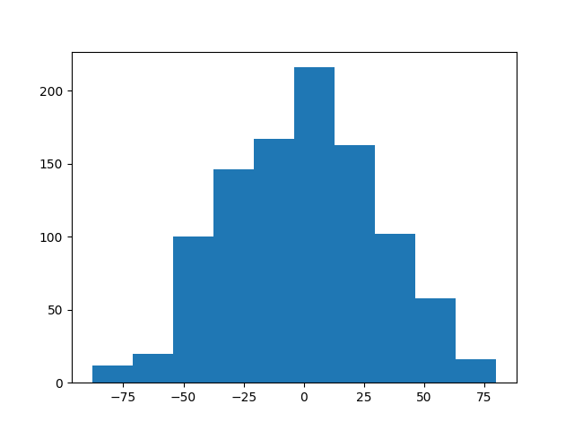
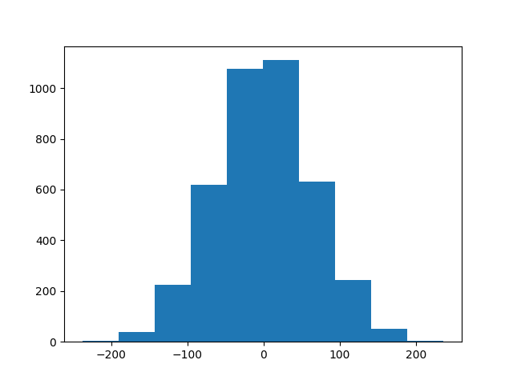
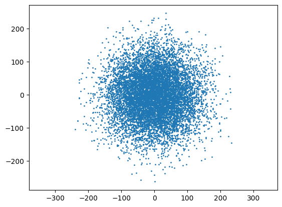
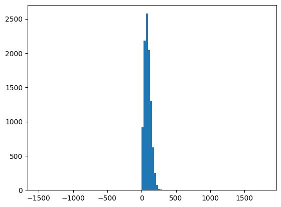

# Rules
Start at position $x\in\mathbb{Z}$. With equal probablity:
- move left ($+1$)
- move right ($-1$)

# Use cases
Random walk-adjacent patterns are seen in:
- pollen in water
- diffusion
- Brownian motion
- ants
- stock prices

For a simple 1D walk, i can do:

$$
x = 
\begin{cases}
    x+1, & \text{if}\ a = 1\\
    x-1, & \text{if}\ a = 0\\
\end{cases}
$$

where $a = 0 \text{ OR } a = 1$ because numpy random numbers are between 0 and 1, I round it to the nearest integer.

# 1D results

After 10 runs, the best position, the last position and the mean position are as follows:
|index|$\max(x)$|final $x$|$\bar{x}$
| ---- | ---- | ---- | ---- |
|1| 3 | 2 | -1.34 | 
|2| 3 | -14 | -5.58 | 
|3| 9 | 8 | -0.5 | 
|4| 3 | -4 | -1.32 | 
|5| 0 | -2 | -4.34 | 
|6| 3 | -22 | -8.44 | 
|7| 11 | 10 | 6.8 | 
|8| 6 | -2 | 1.3 | 
|9| 27 | 24 | 13.3 | 
|10| 4 | 2 | 0.4 | 

Now for 1000 runs, I should store minimum position, final position, maximum position and maximum absolute position (max distance from origin). It'd be too much to store here, and hence it is given in `logs/1000runs.txt`.  

Also, I updated the random choice number to be `np.random.choice([-1, 1])` which is the same but now it allows me to do `x+=step`.

Now I should plot a histogram of the final position, since theoretically it should show a bell curve, with a peak around 30-ish. Since $\sigma \propto \sqrt{N}$ therefore $\sigma \approx \sqrt{1000}$ therefore $\sigma \approx 31.62$.

Now, running 4000:

Logs in `logs/4000runs.txt`. 

# 2D motion
To add 2D motion, I could do the following:
- generate random number between 0 and 4
- if 0, x += 1
- if 1, x -= 1
- if 2, y += 1
- if 3, y -= 1

(Later, I'd do them together)

I can also calculate the distance by the pythagorean theorem.

$$
c = \sqrt{x^2 + y^2}
$$

Now I simulated this with 10,000, and the resulting data is in `logs/10000runs.txt`. The histograph and scatter plot of positions is as follows:

